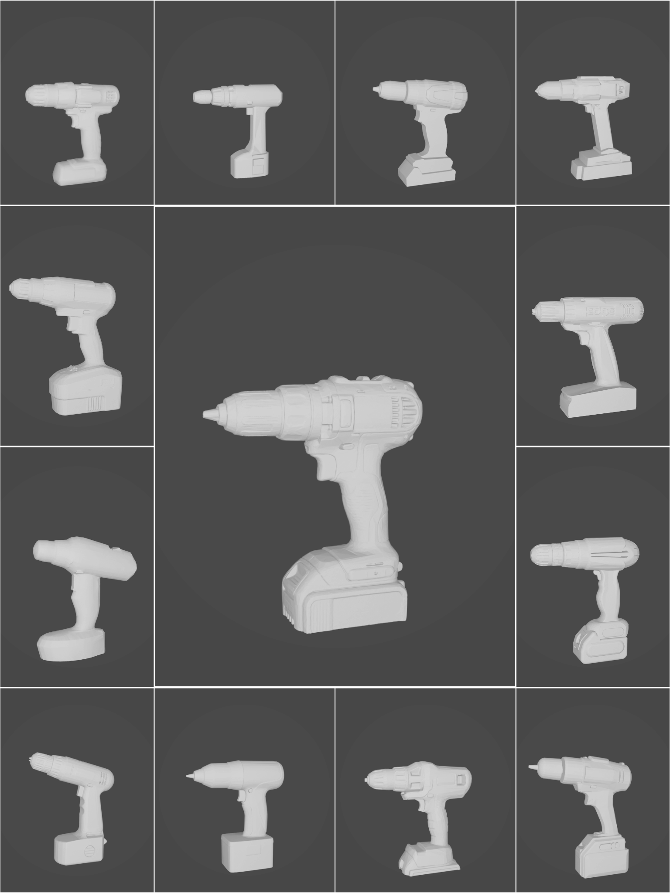
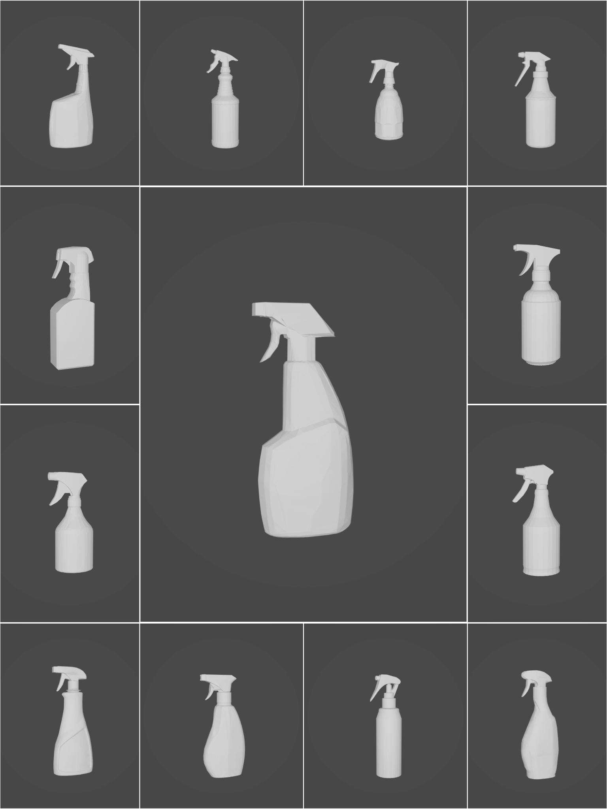
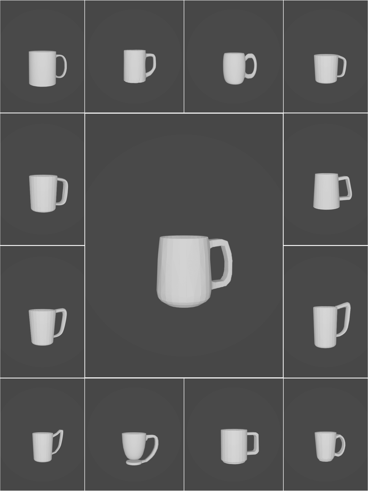

# Functional Categorical Grasping Dataset

### About this repository

This repository contains 3D meshes of objects of three categories:
1. Drills
2. Spray bottles
3. Mugs

### Details

There are 39 meshes in total, 13 per category.

The dataset is particularly useful for research in a field of functional grasping and functional tool use, as each category has a distinct functional grasp required to use an object of that type.

All meshes are scaled to realistic sizes, more specifically: to be grasped by a 5-finger Schunk SIH hand.

   &nbsp;&nbsp;&nbsp;
   &nbsp;&nbsp;&nbsp;
  

